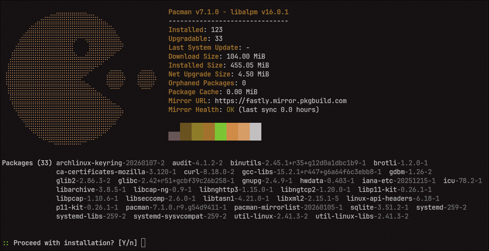

<!-- Banner -->
<p align="center">
  
</p>

<!-- Badges -->
<p align="center">
  <a href="https://github.com/camtisocial/pacfetch/releases">
    
  </a>
  <a href="https://github.com/camtisocial/pacfetch/actions/workflows/ci.yml">
    
  </a>
  
  <a href="https://aur.archlinux.org/packages/pacfetch">
    
  </a>
  
</p>

<p align="center">Stat fetcher and sys upgrade wrapper for pacman</p>

---

## Installation

### AUR
```
wip
```

### Cargo
```
wip
```

### Build from source
```
git clone https://github.com/camtisocial/pacfetch
cd pacfetch
cargo build --release
```
<br>

## Usage
- Run without arguments to see a snapshot of pacman without modifying your local package databases
- or use familiar pacman flags like -Syu to run pacfetch as a neofetch style wrapper

<br>


## Flags and options


  | Flag | Description |
  |------|-------------|
  | `-Sy` | Sync package databases, then display stats |
  | `-Su` | Display stats, then upgrade packages |
  | `-Syu` | Sync databases, display stats, then upgrade 
  | `--ascii <PATH>` | Custom ASCII art file, built-in name, or `NONE` to disable |
  | `--local` | Use local cached database |
  | `-d, --debug` | Show verbose output and execution times per function |
  | `-h, --help` | Print help |
  | `-V, --version` | Print version |

  <br>

## Screenshots

<p align="center">
  
</p>


## Config
```
wip
```
