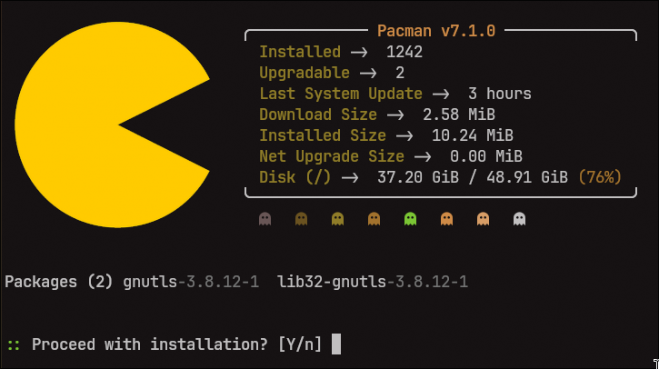
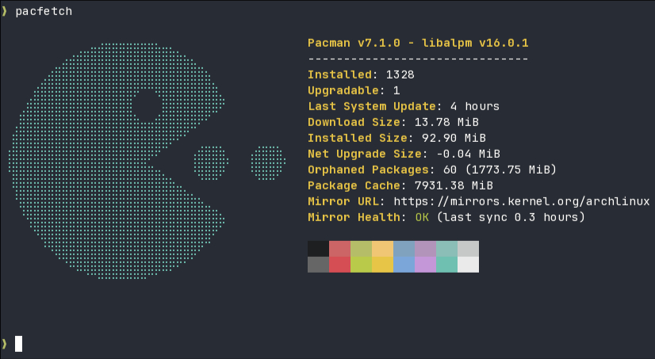
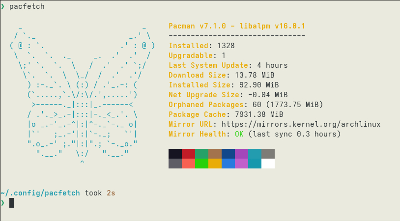
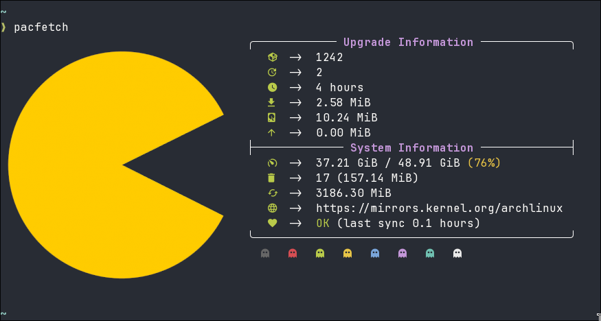
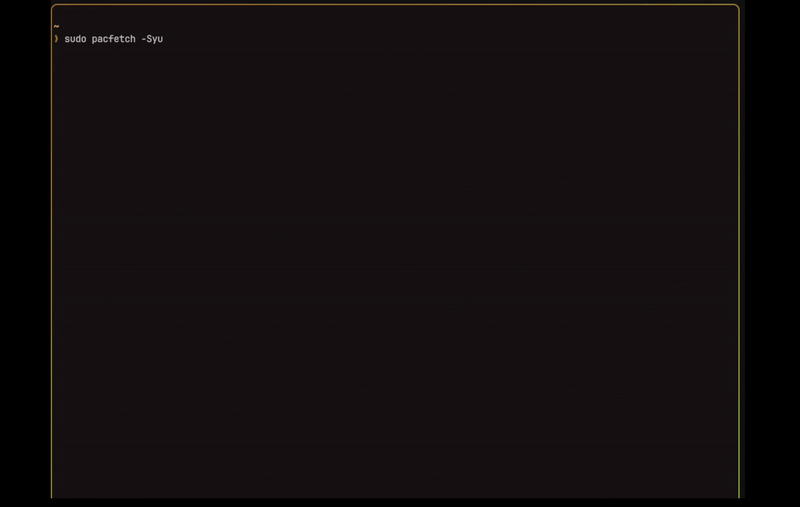

<p align="center">
  
</p>

<div align="center">

<a href="https://github.com/camtisocial/pacfetch/releases">
  
</a>
<a href="https://github.com/camtisocial/pacfetch/issues">
  
</a>
<a href="https://github.com/camtisocial/pacfetch/actions/workflows/ci.yml">
  
</a>
<a href="https://crates.io/crates/pacfetch">
  
</a>
<a href="https://aur.archlinux.org/packages/pacfetch">
  
</a>

<a href="https://github.com/camtisocial/pacfetch/blob/main/LICENSE">
  
</a>

</div>


<p align="center">Neofetch style snapshot and sys update wrapper for the Arch linux package manager</p>

---






<br>
<br>


## Installation

#### AUR
```
yay -S pacfetch
```

#### Cargo
```
cargo install pacfetch
```

#### Build from source
```
git clone https://github.com/camtisocial/pacfetch
cd pacfetch
sudo make install
```
<br>
<br>

## Usage

Run `pacfetch -Syu` to sync and upgrade, or just `pacfetch` to see stats synced to a temp database [(no risk of partial upgrades)](https://wiki.archlinux.org/title/Pacman#Upgrading_packages)


<br>


  | Flag | Description |
  |------|-------------|
  | `no args` | Show stats with sync to temp databases|
  | `-Syu` | Sync databases, display stats, then upgrade 
  | `-Sy` | Sync package databases, then display stats |
  | `-Su` | Display stats, then upgrade packages |
  | `--ascii <PATH>` | Custom ASCII art file, built-in name, or `NONE` to disable |
  | `--local` | Use local cached database |
  | `-d, --debug` | Show verbose output and execution times per function |
  | `-h, --help` | Print help |
  | `-V, --version` | Print version |

  <br>
  <br>

### Configuration & Logs

- User config is automatically created on first run at `~/.config/pacfetch/pacfetch.toml`  
- Error logs are written to `~/.cache/pacfetch/pacfetch.log`

  <br>
  <br>

## Roadmap

**AUR helper integration**  
>`yay` · `paru`

**More options, more stats**  
> `-Si` · `--image` · `--json` · `--aur` · `--news` · `--color` 

**Display customization overhaul**  
>~`colors`~ · ~`glyphs`~ · ~`more underlining options`~ · ~`true color support`~ · ~`spinners/progress bars`~ · ~`stat aliases`~ 

~**Image rendering support**~ 
>~`kitty`~ · ~`sixel`~ · ~`iterm`~

**Distro and terminal compatibility testing** 
> `Manjaro` · `Endeavor`
> 
> ~`kitty`~ · ~`alacritty`~ · ~`konsole`~ · ~`gnome`~ · ~`ghostty`~

  <br>
  <br>
  
## Demo
<p align="center">
  
</p>

<br>
<br>

  ## Customization                                                                                                           
                                                                                                                             
  Config is created on first run at `~/.config/pacfetch/pacfetch.toml`                                                       
                                                                                                                             
  ### Stats                                                                                                                  
                                                                                                                             
  Choose which stats to display and in what order. Insert `"newline"` for blank line spacing.

  ```toml
  [display]
  stats = [
      "title.header",
      "installed",
      "upgradable",
      "last_update",
      "newline",
      "download_size",
      "installed_size",
      "net_upgrade_size",
      "disk",
      "orphaned_packages",
      "cache_size",
      "mirror_url",
      "mirror_health",
      "colors",
  ]
  ```

  Available stats: `installed` · `upgradable` · `last_update` · `download_size` · `installed_size` · `net_upgrade_size` ·
  `orphaned_packages` · `cache_size` · `disk` · `mirror_url` · `mirror_health` · `colors` · `colors_dark` · `colors_light` ·
  `newline`

  ### ASCII Art

  ```toml
  [display]
  ascii = "PACMAN_DEFAULT"  # "PACMAN_DEFAULT", "PACMAN_SMALL", "NONE", or a file path
  ascii_color = "yellow"
  ```

  ### Image

  Set an image path to render a logo alongside stats. Image takes precedence over ASCII art. Protocol (kitty, sixel, iterm)
  is auto-detected.

  ```toml
  [display]
  image = "~/.config/pacfetch/logo.png"
  ```

  ### Titles

  Define named titles under `[display.titles.{name}]` and reference them in the stats array as `"title.{name}"`. You can
  create as many as you want.

  ```toml

  # example embedded title
  [display.titles.header]
  text = "default"
  text_color = "bright_yellow"
  line_color = "none"
  style = "embedded"
  width = "content"
  line = "─"
  left_cap = "╭"
  right_cap = "╮"
  padding = 2

  # footer
  [display.titles.footer]
  text = ""
  style = "embedded"
  width = "content"
  line = "─"
  left_cap = "╰"
  right_cap = "╯"
  ```

  | Option | Values | Default |
  |--------|--------|---------|
  | `text` | `"default"` · `"pacman_ver"` · `"pacfetch_ver"` · `""` · custom string | `""` |
  | `text_color` | color name, hex, `"none"` | `"bright_yellow"` |
  | `line_color` | color name, hex, `"none"` | `"none"` |
  | `style` | `"stacked"` · `"embedded"` | `"stacked"` |
  | `width` | `"title"` · `"content"` · integer | `"title"` |
  | `align` | `"left"` · `"center"` · `"right"` | left for stacked, center for embedded |
  | `line` | string | `"-"` |
  | `left_cap` / `right_cap` | string | `""` |
  | `padding` | integer | `0` |

  ### Colors

  All color values support named colors, hex (`#RRGGBB`), or `"none"` for terminal default.

  ```toml
  # global stat colors
  [display.colors]
  label = "bright_yellow"
  stat = "none"

  # per-stat override (takes precedence over global)
  [display.colors.installed]
  label = "bright_green"
  stat = "white"
  ```

  ### Labels

  Override the display text for any stat label.

  ```toml
  [display.labels]
  installed = "Pkgs"
  cache_size = "Cache"
  disk = "Storage (/)"
  ```

  ### Glyph

  Customize the separator between labels and values.

  ```toml
  [display.glyph]
  glyph = ": "
  color = "none"
  ```

  ### Color Palette

  Configure the appearance of the `colors` / `colors_dark` / `colors_light` stats.

  ```toml
  [display.palette]
  style = "blocks"   # "blocks", "dots", "ghosts", or any custom character
  spacing = 0        # spaces between each color element
  ```

  ### Disk

  ```toml
  [disk]
  path = "/"
  ```

  ### Cache

  ```toml
  [cache]
  ttl_minutes = 15   # set to 0 to always sync fresh
  ```

  <br>
  <br>

## Contributing
See [CONTRIBUTING.md](CONTRIBUTING.md) 


  <br>
  <br>
  <br>
  <br>


